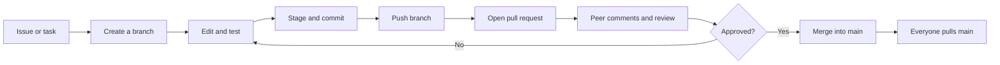
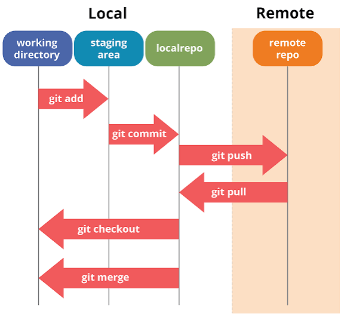

# GitHub collaboration for design students

A beginner-friendly teaching kit for master’s design students who need to store, share, discuss, and safely improve a web-app project with Git and GitHub—with or without typing terminal commands.

## Learning outcomes

After this lesson, students should be able to:

- distinguish Git (version control) from GitHub (hosting and collaboration);
- explain repositories, branches, commits, pushes, pulls, diffs, issues, pull requests, reviews, merges, and conflicts;
- make a focused change without editing the shared `main` branch directly;
- inspect a diff, request a peer review, respond to comments, and merge approved work;
- use an LLM coding agent to inspect, edit, test, and review a project while retaining human control.

## The central workflow

> **One task = one branch = one pull request.** Treat `main` as the agreed, stable version.

This collaboration loop extends the individual save-and-sync model shown below.

## How Git stores and transfers changes

**Figure 1. Simplified four-area model of Git data movement.** The horizontal position represents the context in which project information exists: editable files in the working directory, selected changes in the staging area, committed history in the local repository, and shared committed history in a remote repository. The arrows identify common Git operations. `git add` selects changes for the next commit; `git commit` records a local checkpoint; `git push` transfers local commits to a remote; and `git pull` fetches remote changes and integrates them into the current local branch. **Note.** This conceptual figure is useful for introducing storage states, but it is not a complete collaboration model. It omits branches, issues, pull requests, review, and conflict resolution. Its `git merge` arrow should not be interpreted as merely moving files into the working directory: merge combines development histories. For beginners, prefer `git switch` for changing branches and `git restore` for restoring files instead of the older, overloaded `git checkout`. Source: image supplied by the course author; 571 × 536 px, PNG. Rights and original attribution were not provided—confirm them before public redistribution.

## Essential concepts in plain language

| Concept | Meaning |
|---|---|
| Repository | The project files plus their recorded history |
| Local repository | The copy and history on a student’s computer |
| Remote repository | The shared copy and history hosted on GitHub |
| Clone | Create a local copy of a remote repository |
| Commit | A named checkpoint containing selected changes |
| Branch | A separate line of work for one task or experiment |
| Push | Send local commits to the remote repository |
| Pull | Fetch remote work and integrate it into the current branch |
| Diff | The exact lines added, removed, or changed |
| Issue | A place to define and discuss a task, bug, or idea |
| Pull request | A proposal to review and merge one branch into another |
| Review | Comments, suggestions, approval, or requested changes |
| Merge | Combine compatible development histories |
| Conflict | A situation Git cannot combine automatically and a person must resolve |

Git is not automatic cloud backup. A file is protected in local history only after it is committed, and appears on GitHub only after the commit is pushed.

## Can students work without a terminal?

Yes—students do not need to type terminal commands for this introductory workflow.

| Responsibility | Suggested interface |
|---|---|
| Clone, branch, inspect changes, commit, pull, and push | GitHub Desktop |
| Issues, pull requests, line comments, reviews, and merging | GitHub website |
| Inspect, explain, implement, test, and propose changes | Codex or Claude Code |
| Decide whether a change is correct and should be integrated | Student |

“No terminal typing” does not mean “no commands are executed.” Web apps still need package installation, development servers, builds, and tests. A coding agent or graphical application can execute those operations, but students should inspect the proposed changes and results.

## Teaching materials

- [Command guide](docs/COMMANDS.md) — terminal commands, GitHub Desktop equivalents, and safe routines
- [LLM prompt library](docs/PROMPTS.md) — copy-ready prompts plus explanations of what each prompt enables
- [Two-hour lesson plan](docs/LESSON-PLAN.md) — teaching sequence, exercise, and assessment criteria
- [Contribution guide](CONTRIBUTING.md) — the workflow students should use in a shared repository
- [Image record](assets/README.md) — figure metadata, interpretation, and reuse note

## Three safety rules

1. Never commit `.env` files, API keys, passwords, private participant data, or `node_modules`.
2. Never accept an AI-generated change without reading the diff and checking the result.
3. Do not teach `git push --force`, `git reset --hard`, history rewriting, or complex rebasing in the introductory lesson.

## Further information

- GitHub Docs: [Hello World and the pull-request workflow](https://docs.github.com/en/get-started/using-github/hello-world)
- GitHub Docs: [What is GitHub?](https://docs.github.com/en/get-started/start-your-journey/what-is-github)
- GitHub Docs: [Connect to GitHub without memorizing command-line commands](https://docs.github.com/en/get-started/using-github/connecting-to-github)
- GitHub Docs: [Review pull requests](https://docs.github.com/en/pull-requests/get-started/reviewing-pull-requests-quickstart)
- OpenAI Docs: [Review code changes with Codex](https://learn.chatgpt.com/docs/code-review)
- OpenAI Docs: [Review GitHub pull requests with Codex](https://learn.chatgpt.com/docs/third-party/github)
- Anthropic Docs: [Claude Code overview](https://code.claude.com/docs/en/overview)

Official documentation accessed 8 September 2026.
